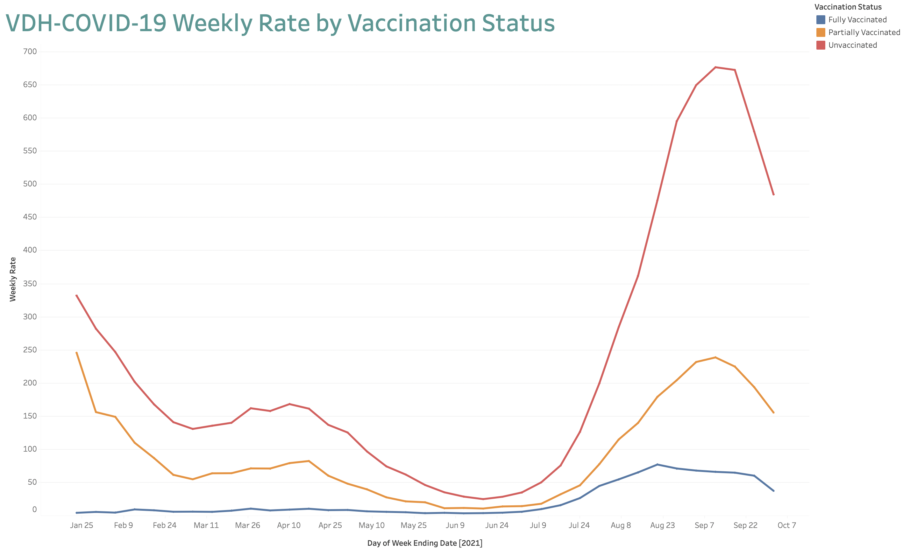
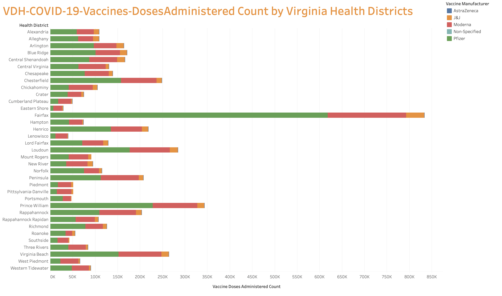
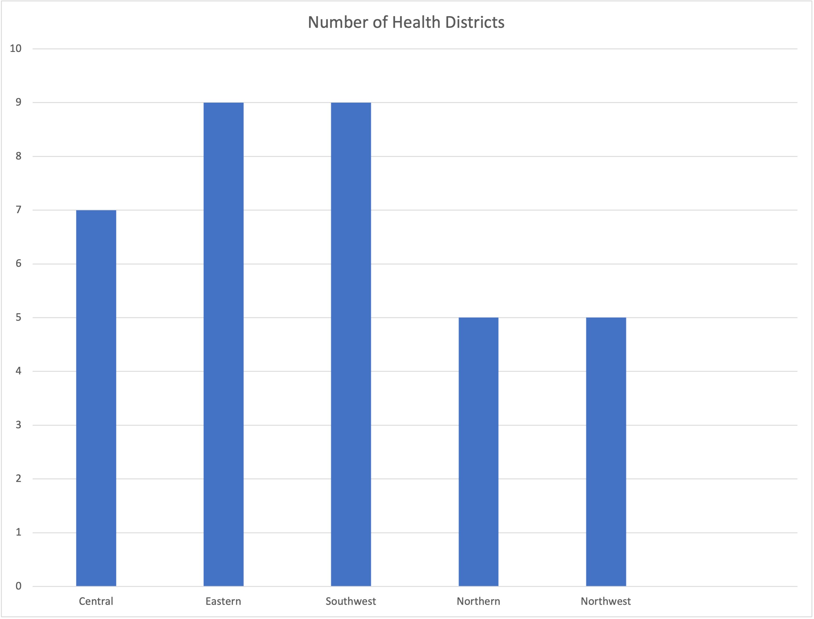
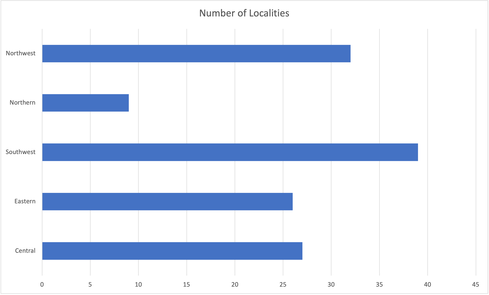

## Part 1 - Using Tableau

##### Dataset: [1](https://data.virginia.gov/dataset/VDH-COVID-19-PublicUseDataset-Cases-by-Vaccination/vsrk-d6hx/data)

##### Online Tableau Workbook: [Part 1](https://prod-useast-a.online.tableau.com/#/site/oducs625/workbooks/366504?:origin=card_share_link)

##### Chart created: 

I used tableau online to do this chart. Line charts show a trend, hence it is used to observe change over time. 
First exported the given dataset as .csv file and uploaded the file to tableau worksheet. 
The parameters used to visualize are *Report Date*, *Vaccination Status*, *Week Ending Date* and *Weekly Rate*. 

To filter and keep the items only with the most recent report date, add *report date* to the *filters* section and choosed the required option.

Created a new calculated field in Tableau as *Weekly Rate*. 

Formula used: *[Infections]/[Population Denominator]x100000*.

This process is done by clicking on *Analysis -> Create Calculated Field*. Now name the Calculation filed as *Weekly Rate* and enter formula as mentioned above.

Marks are used to denote vaccination status, so each color represents a different status as seen in the Chart 1 image. Week Ending Date is temporal and Weekly Rate is a quantitative field. 
I named the chart as "VDH-COVID-19 Weekly Rate by Vaccination Status".

##### How has the weekly rate of COVID-19 cases in Virginia changed over time based on vaccination status?
The weekly rate of COVID-19 cases in Virginia over vaccination status is being compared in this chart. For Fully Vaccinated Status, the weekly rate decreased gradually till July followed by a peek increment up to September and then there was a sudden decrease. Over time the trend for Partially Vaccinated Status is almost similar. For Unvaccinated Status, the weekly rate was almost similar through out the year till July 9, 2021. Then there was a slight increase for a month up to August 21, and again there is a continuous decrease till October 2, 2021.

## Part 2 - Using Tableau

##### Dataset: [2](https://data.virginia.gov/Government/VDH-COVID-19-PublicUseDataset-Vaccines-DosesAdmini/28k2-x2rj/data)

##### Online Tableau Workbook: [Part 2](https://prod-useast-a.online.tableau.com/#/site/oducs625/workbooks/366532?:origin=card_share_link)

##### Chart created: 

First exported the given dataset as .csv file and uploaded the file to tableau worksheet. The parameters used to visualize are *Vaccine Manufacturer*, *Health District*, *Vaccine Doses Administered Count* and *Dose Number*. 

Marks are used to denote vaccination Manufacturer, so each color represents a different kind of vaccine as seen in the Chart 2 image. Health Region is Categorical and Vaccine Doses Administered Count is quantitative.

As mentioned to do, excluded the "health districts" labeled "Out of State" and "Not Reported".

Added *Dose Number* to *filter* section and select only dose number 1 so that we can see the proportion of all 1st doses of the Pfizer vaccine for each health district in Virginia.

##### For each health district in Virginia, what proportion of all 1st doses were of the Pfizer vaccine?

The "Health District" is plotted against the "Vaccine Doses Administered Count. 
From the picture shown above (part 2), comparing the 1st doses of pfizer with other vaccines for each health district in Virginia, Fairfax has the highest count where as Eastern Shore has the lowest count.
Different color is used as we can easily identify from the size of the bar.

## Part 3

#### Propose two questions that require data from dataset 1 and dataset 2 to be combined to answer. Describe what data manipulation would need to be done to answer each question. Sketch a chart that could be used the answer each question. Justify your visualization idiom choice.

##### Q1. Which Health Region has the highest number of Health Districts and Locality?
For this, I used the pdf given. With that information, created an excel sheet and plotted a chart to find the answer.

##### Chart created: 

From the image above, it is observed that both Southwest and Eastern Regions have equal and the highest number of health districts.

I chose bar chart for this visualization as it is easy to identify from the size of the bar.

##### Q2. Which Health Region has the least number of Localities?
For this, I used the pdf given. With that information, created an excel sheet and plotted a chart to find the answer.

##### Chart created: 

From the image above, it is observed that Northern Region has the least number of localities.

### References:
Actually I didn't use any references for this homework except the given datasets and pdf as I already used tableau for previous homework.

1. [pdf](https://www.vdh.virginia.gov/content/uploads/sites/182/2020/08/VA-regions_districts_localities.pdf)
2. [Dataset 1](https://data.virginia.gov/dataset/VDH-COVID-19-PublicUseDataset-Cases-by-Vaccination/vsrk-d6hx)
3. [Dataset 2](https://data.virginia.gov/dataset/VDH-COVID-19-PublicUseDataset-Vaccines-DosesAdmini/28k2-x2rj)

